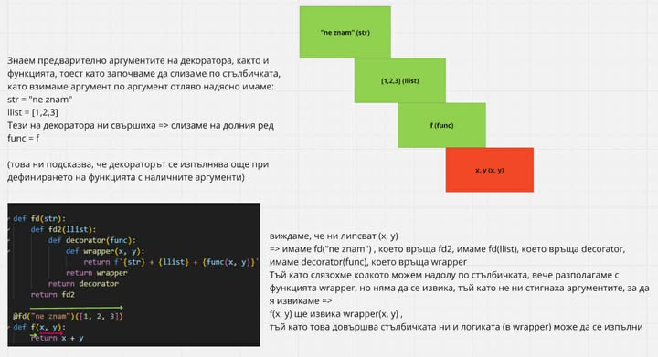

# Области на видимост в Python

## Основи на обхвата (Scope)
- Всяка променлива (име) може да бъде свързана със стойност (binding).
- Има операции, които променят свързването, например `=`.

### Примери:
```python
global_one = 1
def foo():
    local_one = 2
    print(locals())

print(globals()) # {..., 'global_one': 1}
foo() # {'local_one': 2}
```
- `locals()` – връща речник с всички имена в локалната област на видимост.
- `globals()` – връща речник с всички имена в глобалната област на видимост.

### Локални и глобални променливи:
```python
global_one = 1  # това е глобална променлива
def foo():
    global_one = 2  # това е локална променлива
    print(global_one)
    print(locals())

# Двете променливи не са едно и също нещо.
# Когато създадем променлива със същото име във вътрешен обхват, се използва тя.
# Състоянието на едната не влияе на състоянието на другата.
foo()  # ... {'global_one': 2}
print(globals())  # {..., 'global_one': 1, ...}
```

### Подадените аргументи също отиват в `locals()` на функцията:
```python
def outer(x):
    print(x)
    def inner():
        x = 0  # ако това го нямаше, долното щеше да изведе празен речник
        print(locals())
    inner()
    print(locals())

outer(3)
```

---

## Closure
**Closure възниква, когато:**
1. Имате вложена функция (функция, дефинирана в друга функция).
2. Вложената функция използва променливи от външната функция.
3. Външната функция връща вложената функция, а нейните променливи продължават да съществуват.

### Пример:
```python
def start(x):
    z = 0
    def increment(y):
        print(locals()) 
        return x + y + z

    print(locals())    
    return increment

first_inc = start(0)
print(first_inc(3))  # 3
```

**Бележка:** При closure параметрите на обвиващата функция се запомнят и стават част от затворения контекст на вътрешната. Затворените променливи (например `x`, `z`) се показват в локалното пространство на имената на вътрешната функция, въпреки че технически те са част от затворения контекст.

---

## Global vs Nonlocal

### Global
- **`global`** декларира, че дадена променлива се отнася към глобалния обхват (обхватът на модула).
- Позволява на функцията да чете и модифицира глобална променлива.

#### Четене на глобална променлива:
```python
x = 10  # Глобална променлива

def modify_global():
    print(x)
        
modify_global()  # 10
```

#### Манипулация на глобална променлива:
```python
x = 10  # Глобална променлива

def modify_global():
    try:
        x += 5  # манипулация => търси локална променлива x, а такава няма
    except UnboundLocalError as err:
        print(str(err))  # cannot access local variable 'x' where it is not associated with a value

modify_global()  # cannot access local variable 'x' where it is not associated with a value
```

#### Решение с `global`:
```python
x = 10  # Глобална променлива

def modify_global():
    global x
    x += 5
        
modify_global()
print(x)  # 15
```

---

### Nonlocal
- **`nonlocal`** декларира, че дадена променлива се отнася към обхвата на най-близката обвиваща функция, която не е глобалният обхват.
- Позволява на вътрешна функция да чете и модифицира променливи от обвиващата функция.

#### Пример:
```python
def modify():
    x = 10
    
    def f():
        nonlocal x  # без nonlocal ситуацията става подобна на горния пример
        x += 50
    f()
    print(x)
    
modify()  # 60 
```

#### Пример с вложени функции:
```python
def modify():   
    x = 10
    def f():
        def g():
            nonlocal x  # най-близкият nonlocal x е този на modify()
            x += 50
        g()
    f()
    print(x)
    
modify()  # 60 
```

#### Nonlocal с различни обхвати:
```python
def modify():   
    x = 10
    def f():
        x = 30
        def g():
            nonlocal x  # най-близкият nonlocal x е този на f()
            x += 50
        g()
        print(x)  # 80
    f()
    print(x)  # x не се променя, защото вътре сме променили друг x

modify()  # 80 10
```

---

## Заключение
- **`global`** е необходима, когато искаме да модифицираме глобална променлива в рамките на функция.
- **`nonlocal`** е необходима, когато искаме да модифицираме променлива от обвиваща функция.
- Четенето на променливи следва **LEGB правилото**, докато манипулацията изисква явна декларация чрез `global` или `nonlocal`.


## Декоратори накратко 

### Примери със снимки




